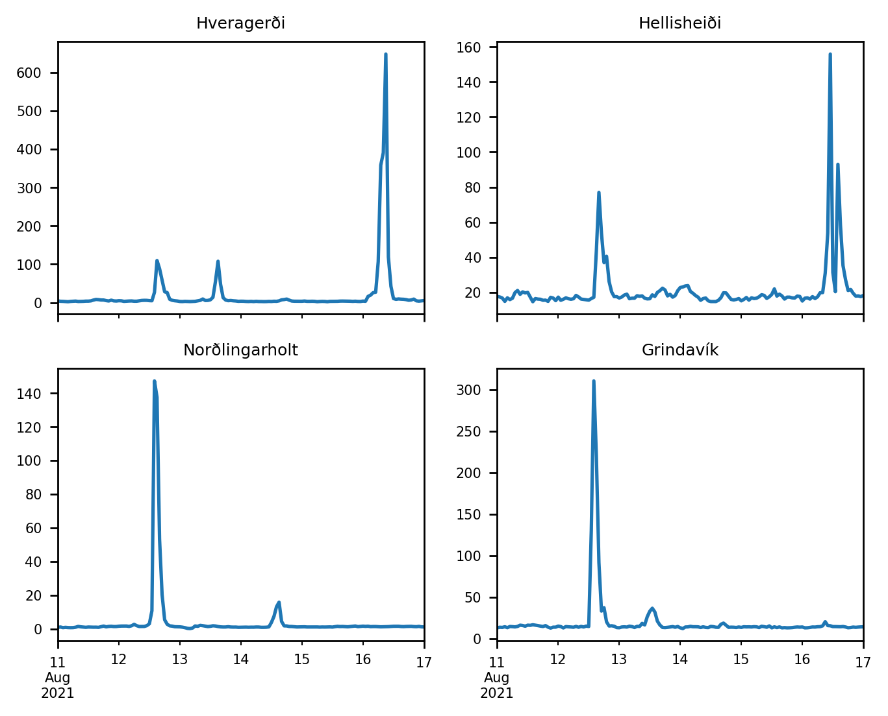
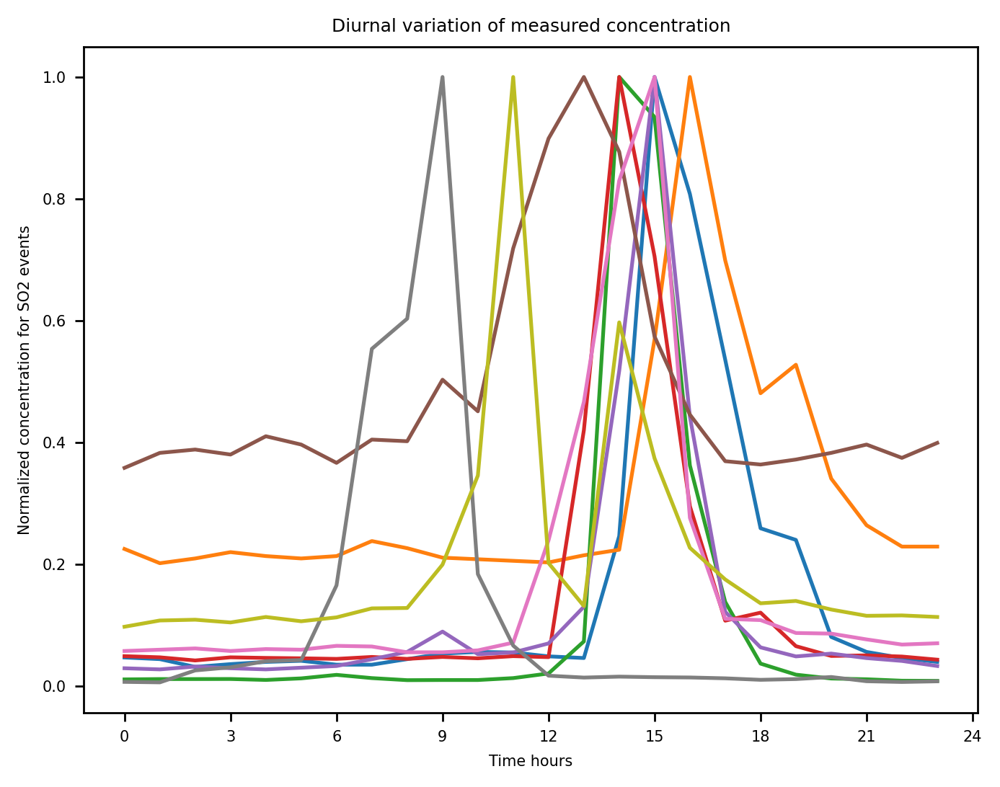
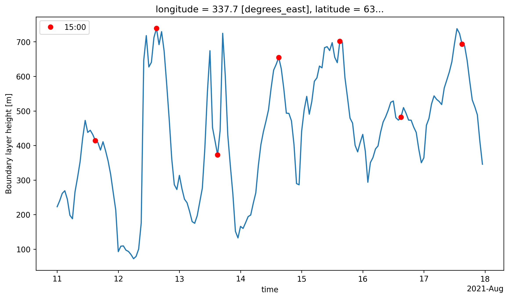
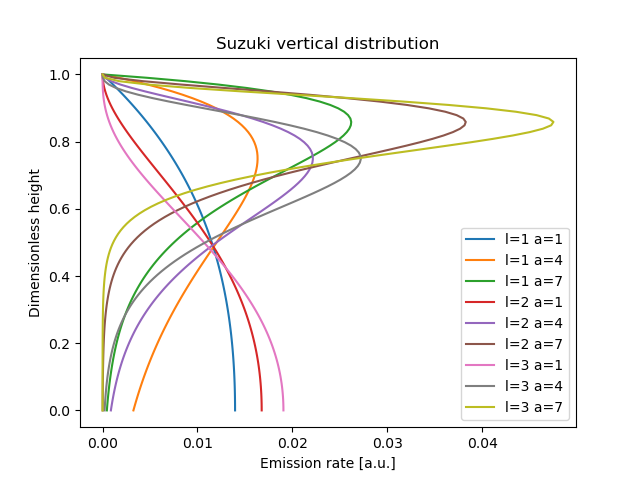
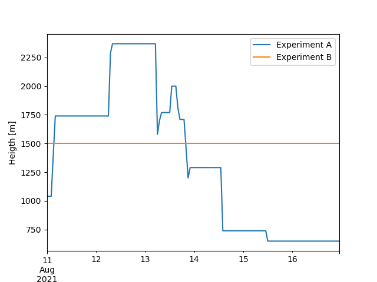
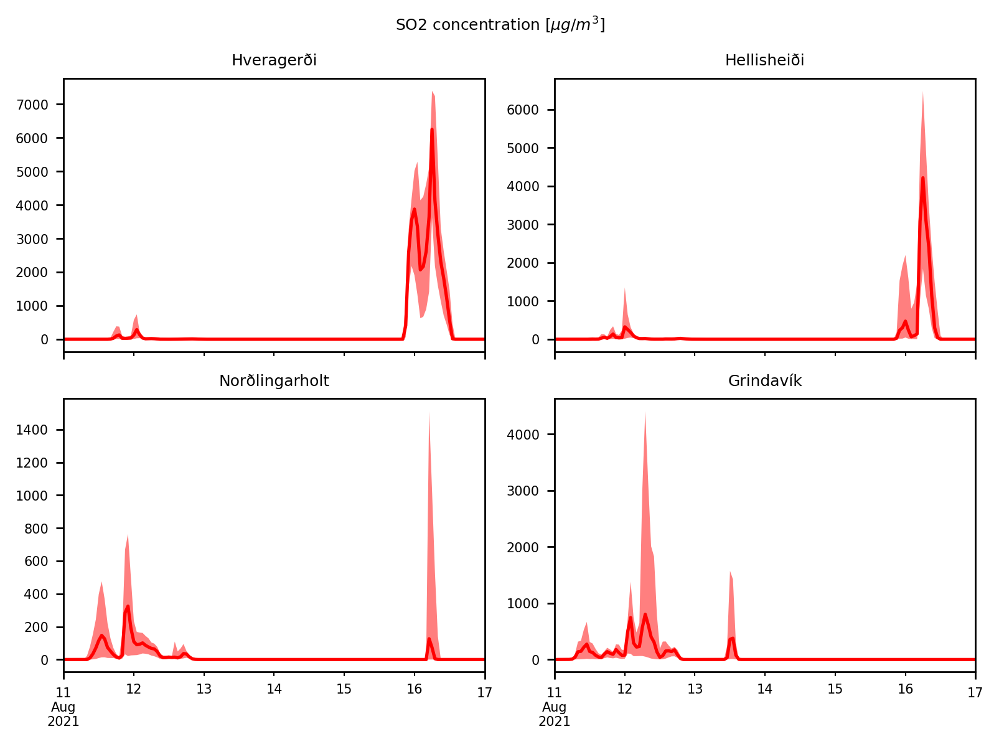
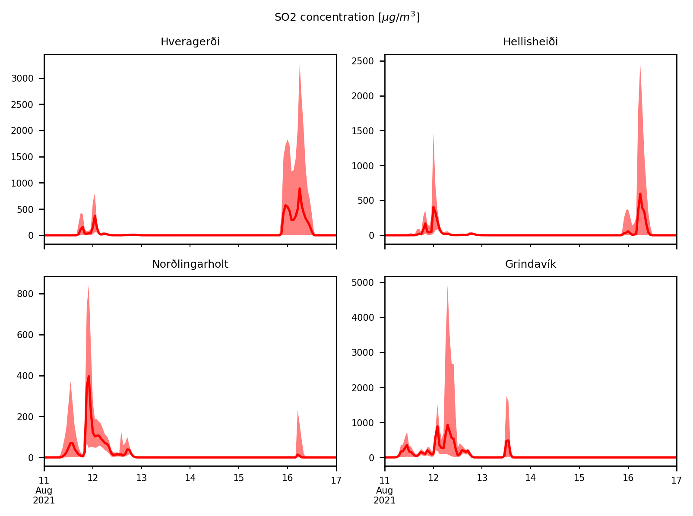
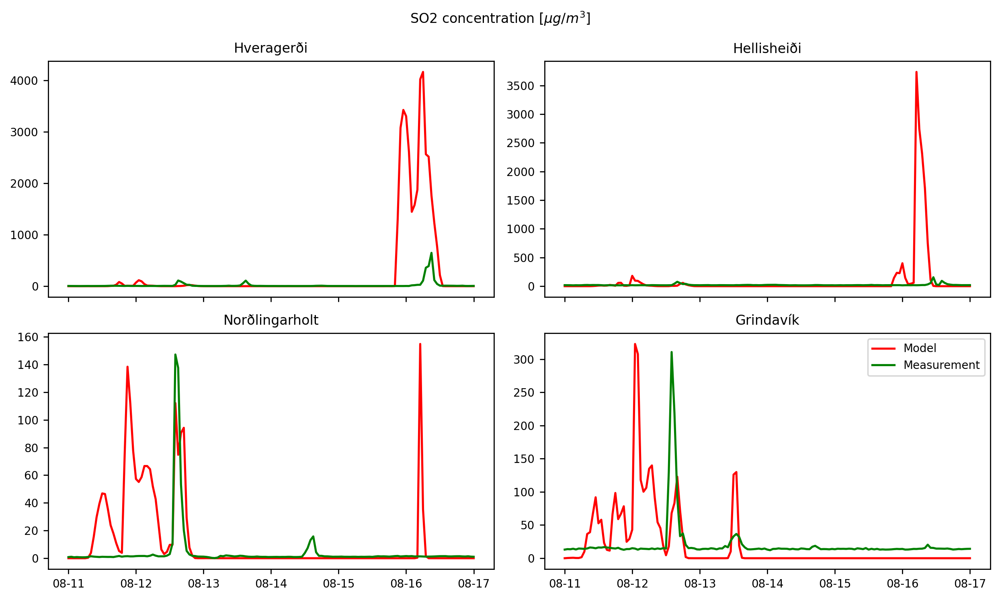
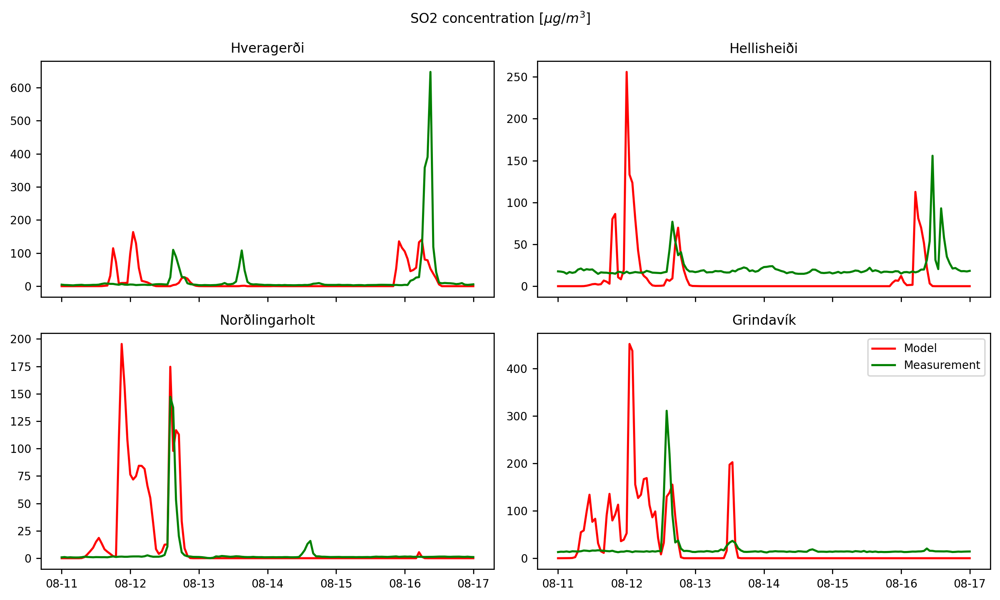

---
author:
    - L. Mingari$^1$
    - S. Barsotti$^2$
institute:
    - $^1$Geosciences Barcelona
    - $^2$Icelandic Meteorological Office
title: Modelling SO2 dispersion during the 2021 eruption of Fagradalsfjall, Iceland
description: Workshop, IMO, Iceland
date: 26 September 2024
---

## References
Pfeffer, Melissa A., et al. "SO2 emission rates and incorporation into the air pollution dispersion forecast during the 2021 eruption of Fagradalsfjall, Iceland." Journal of Volcanology and Geothermal Research 449 (2024): 108064.
<https://doi.org/10.1016/j.jvolgeores.2024.108064>

## Observations
We considered measurements of SO2 concentration at 4 ground stations with a radius of about 50 km between 11-Aug-2021 and 17-Aug-2021.

Concentration timeseries show a diurnal variation pattern?

Forecasts for the Boundary layer thickness show maximum heights around 15:00

## Numerical simulations - Configuration
We performed 70-member ensemble simulations of SO2 transport using the FALL3D model. Different source term parameters were perturbed.

| Parameter | Reference | Perturbation range |
| --------  | -------- | -------- |
| Suzuki-A  | 4     | 3           |
| Suzuki-λ  | 2     | 1.5         |
| Wind componentes | IFS on model levels | 20%  |
| Column height | See figure below | 20% |
| Emission rate | Fixed (100 kg/s) | No perturbed |

### Meteorological dataset
Operational forecasts are produced with the ECMWF Integrated Forecasting System (IFS) with a horizontal resolution of 9 km using 137 layers in the vertical.

### Vertical distribution
We explored different vertical distributions:

### Column height
We performed to ensemble simulations. In experiment A, the source term is
defined from a timeseries of column height estimations. In experiment B,
a fixed column height is assumed (1500 m above the vent).

## Results: Ensemble variability

### Experiment A

### Experiment B

## Results: SO2 dispersion (control member)
<video width=100% controls>
  <source src="figs/maps.mp4" type="video/mp4">
</video>

## Results: Best ensemble member
The linear correlation between every member and the observations was computed
and the best ensemble member was selected:

### Experiment A

Precision = TP/(TP+FP) = 25%

### Experiment B

Precision = TP/(TP+FP) = 27%

## Results: Vertical mixing

<video width=100% controls>
  <source src="figs/cross.mp4" type="video/mp4">
</video>
